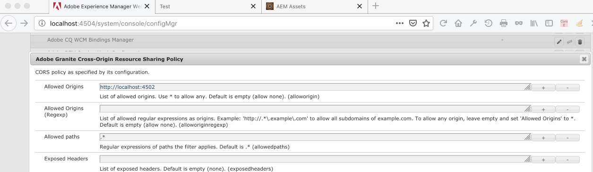
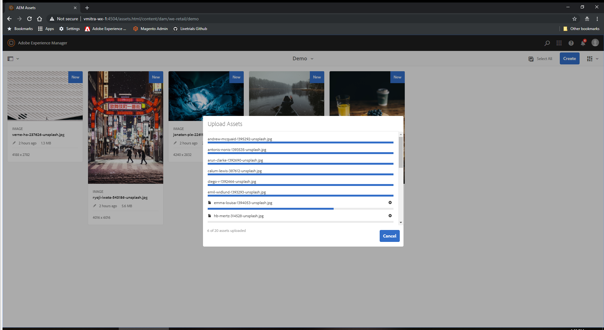
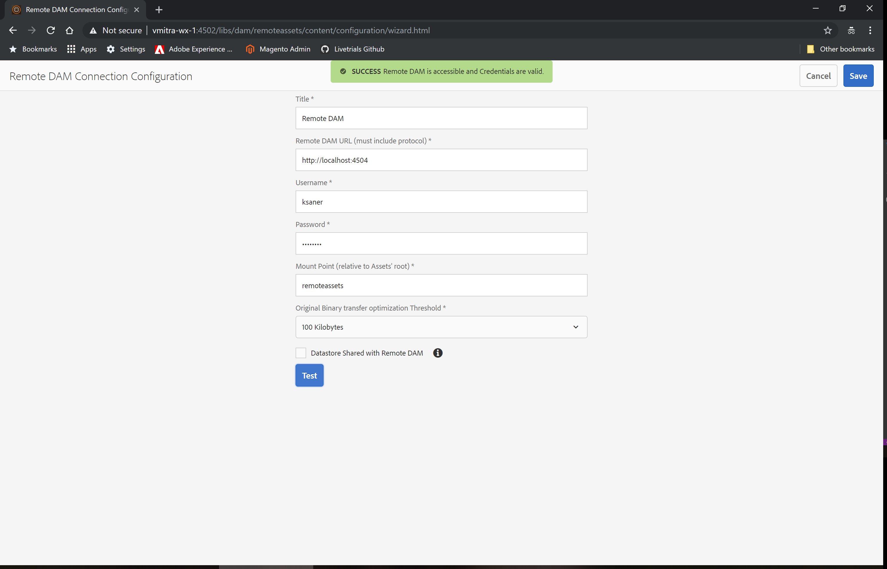
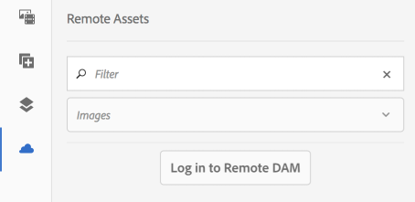
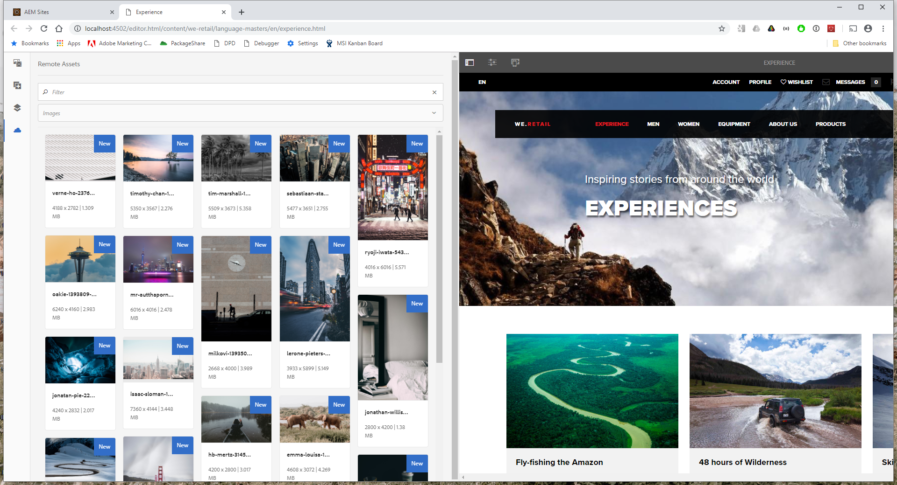
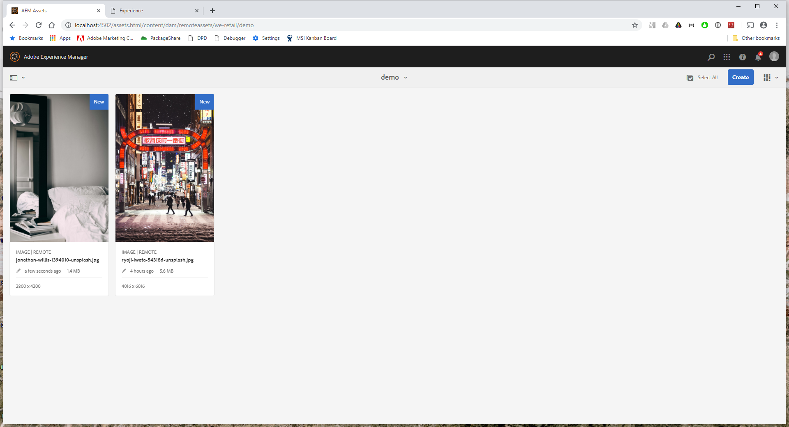

#### Connected DAM

##### Objective

Integrate local instance of AEM Sites with a different instance of AEM Assets

##### Lesson Context

AEM now provides capability to use assets from a DAM repository in websites created on separate AEM instances. While editing pages in Page Editor, the authors can seamlessly search, browse, and embed assets from a different AEM Assets instance.

You can integrate your local instances of AEM Sites with a different (remote) instance of AEM Assets. Your authors can browse, search for, and use assets just as they do for local instance of Assets. AEM Administrators create an integration between the two instances once and users continue to use it seasmlessly. A few limitations and the prerequisites are called out in this article.

For the Sites authors, the remote assets continue to be available and behave as read-only local assets.

##### Prerequisites
Before you use or configure this capability, ensure the following:

1. An AEM 6.5 Assets instance (running on Port 4504).
2. AEM 6.5 Sites instance (running on Port 4502)
3. The users are part of appropriate user groups on each instance.

##### Exercise 1.1: Set Up Assets Instance
1. Start AEM 6.5 Assets Instance on port 4504.
2. Log on to the Assets Instance using Admin credentials
3. Goto Tools > Operations > Websconsole
4. Look for `Adobe Granite Cross-Origin Resource Sharing Policy` configuration.
5. Set the `Allowed Origins` property to `http://localhost:4502` (Sites Instance)


6. Save
7. Goto Assets > Files > We.Retail 
8. Create a new folder and upload a few [images](https://git.corp.adobe.com/aem-enablement/aem65livetrials/tree/master/assets/Connected%20DAM/Demo%20Images)




##### Exercise 1.2: Set up AEM Sites Instance
1. Start AEM 6.5 Sites Instance on port 4502.
2. Log onto the Sites Instance using Admin credentials.
3. Goto Tools > Assets > Remote DAM Configuration
4. Create a new configuration:
    * Title: Remote DAM
    * Remote DAM URL (must include protocol): http://localhost:4504
    * Username: ksaner
    * Password: password
    * Mount Point (relative to Assets' root): remoteassets
    * Original Binary transfer optimization Threshold: 100 Kilobytes
5. Click `Test`
6. Click `Save`



##### Exercise 1.3: Use Connected DAM
1. Log on to Sites Instance using ksaner credentials 
    * Username: ksaner
    * Password: password
```
This user has authoring permissions on both the AEM instances.
```
2. Open a We.Retail website page at Sites > We.Retail > Language Masters > us > en. Edit the page. 
3. Alternatively, access http://localhost:4502/editor.html/content/we-retail/language-masters/en/men.html in a browser to edit a page.
4. Click Toggle Side Panel on upper-left.
5. Open the Remote Assets tab and click Remote DAM button to log in.



6. Provide the credentials -- ksaner as user name and password as password. 
7. Search for the asset of your choice that you added to DAM. Drag-and-drop the asset in an Image component.



8. While the fetched assets are read-only, you can tweak the options allowed by your Sites components to edit the asset used in the Sites component.
9. Assets that are used on the Page will be stored im the remoteassets folder on the Sites Instance




##### Extra Credit

Adjust the launcher configurations on the AEM Sites instance to exclude the remotedam folder where remote assets are fetched. 
```
As assets fetched from Remote DAM are pre-processed, we need to prevent Asset Workflow launchers from triggering any asset processing workflows on Local Sites
 ```
1. On AEM Sites instance (M1), click Tools > Workflow > Launchers.
2. Search for Launchers with Workflow as DAM Update Asset and DAM Metadata Writeback.
3. Update their regular expressions to exclude the mount point remoteassets. 
4. Select the workflow launcher, click Properties on the action bar. In the properties wizard, change the Path fields as the following `before → after mappings`.
    * `/content/dam(/((?!/subassets).)*/)renditions/original` → `/content/dam(/((?!/subassets)(?!remoteassets).)*/)renditions/original`
    * `/content/dam(/.*/)renditions/original` → `/content/dam(/((?!remoteassets).)*/)renditions/original`
    * `/content/dam(/.*)/jcr:content/metadata` → `/content/dam(/((?!remoteassets).)*/)jcr:content/metadata`