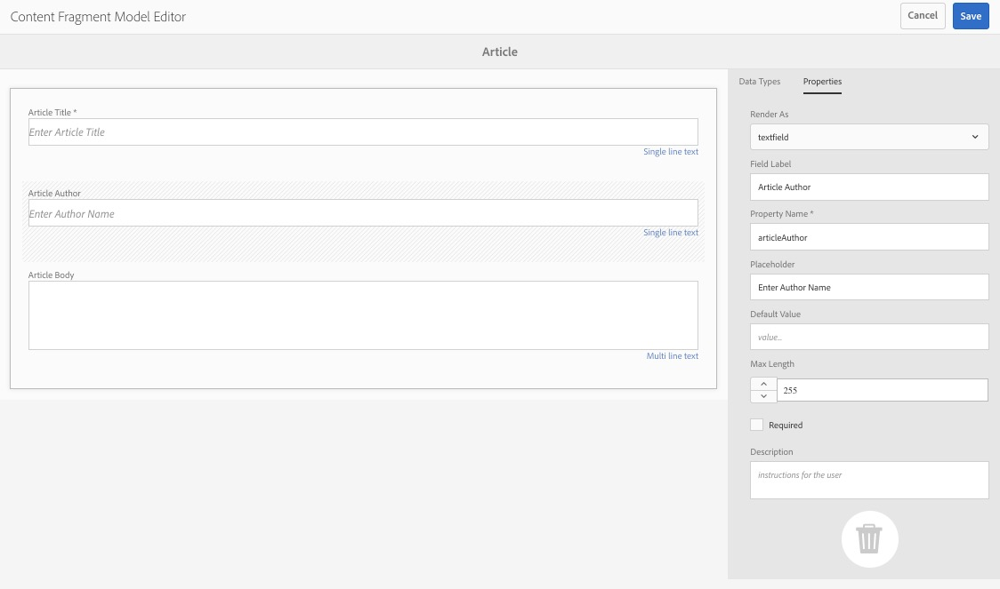
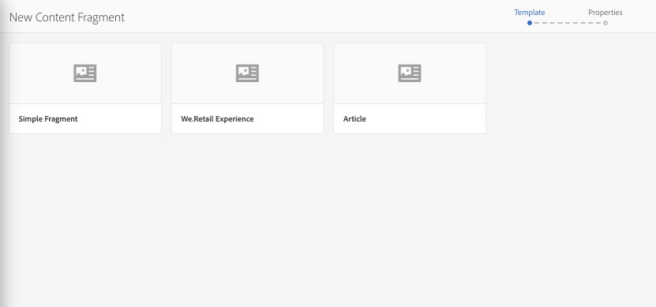
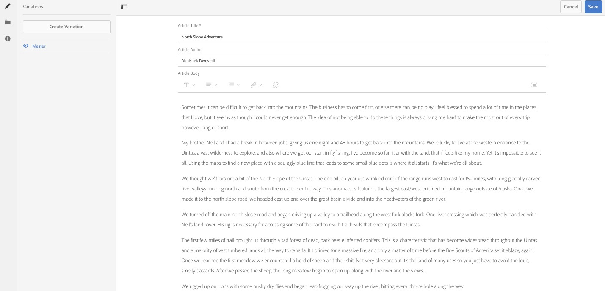
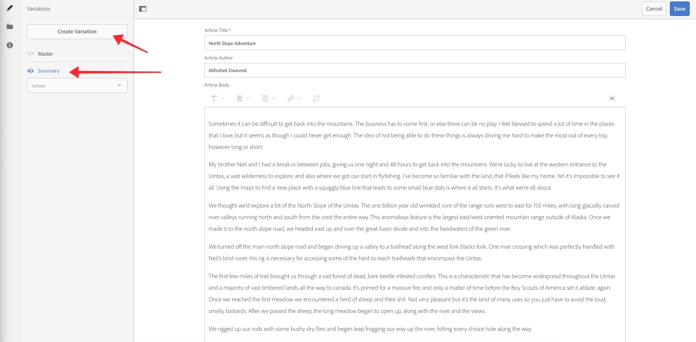
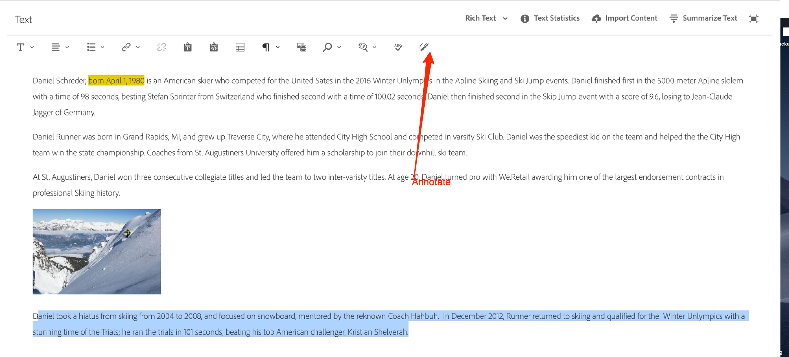
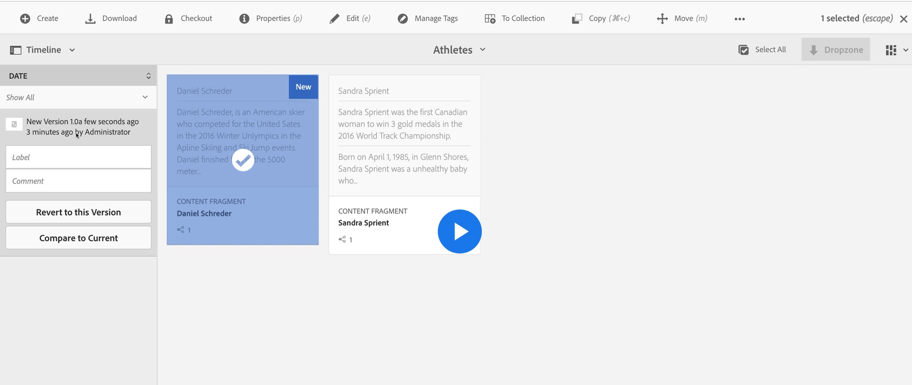
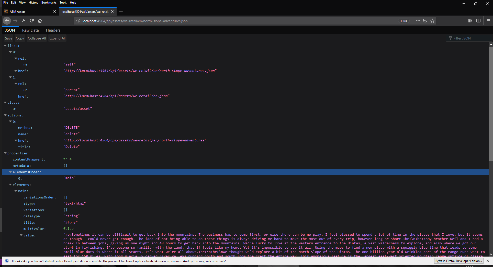

## Lesson 1 - Using Content Fragments in AEM

### Objective

1. Determine the usage of Content Fragments
2. Create Content Fragment Models
3. Create Content Fragments using the Content Fragment Model
4. Add variations in content fragments
<<<<<<< HEAD
5. Download Content Fragments
6. Use the editing capabilities of Content Fragments
7. Expose JSON from Content Fragments 

=======
5. Use the editing capabilities of Content Fragments
6. Expose JSON from Content Fragments
>>>>>>> 17430953dae96e76ecee2c74778318ce7d83f835

### Lesson Context

In this lesson, we will learn how to use Content Fragments in AEM and explore their benefitss. We will create Content Fragments using an underlying schema content defined in the Content Fragment Model. We will also explore variations and a few other features of Content Fragments.

#### Exercise 1.1

In this exercise, we will create an initial **Content Fragment Model**.

1. Create a new Content Fragment Model

2. Add the following fields: 
    
   * Field Label :Article Title
   * Type: **Single line text**

   * Field Label: Article Author
   * Type: **Single line text**

   * Field Label: Article Body
   * Type: **Multi line text**
   



#### Exercise 1.3

Now that we have a Content Fragment Model, we will use it to create a Content Fragment.

1. Create a new Content Fragment using the Article Content Fragment Model.
   
   

2.  Add content to this article.
   
 


#### Exercise 1.4 

As content owner, we also want to create Content Fragment variations for other channels and requirements.

1. Create a new Variation (Summary Variation) of the Content Fragment



2. Use Out-of-the-Box (OOTB) summarization feature for content fragments to summarize the article. 


#### Exercise 1.5 Using Editoral Capabilities in Webpages of Content Fragments

1. Click into a Content Fragment and choose a multi-line text field.
2. Select the annotate field in order to set up collaboration with other authors.


3. Open a Content Fragment and choose Timeline to compare the different versions.


#### Exercise 1.7 Exporting Content Fragments as JSON Using the AEM Assets HTTP API

1. Use the AEM Assets HTTP API to export the Content Fragment to JSON format.

2. /api/assets/(content-fragment-relative-path).json invokes the AEM Assets HTTP API
```
Hint: Replace /content/dam in the CF URL with /api/assets and add .json as an extension.
```



Resource:

 Article Body   :  [Text from file](images/cftext1.txt) 
