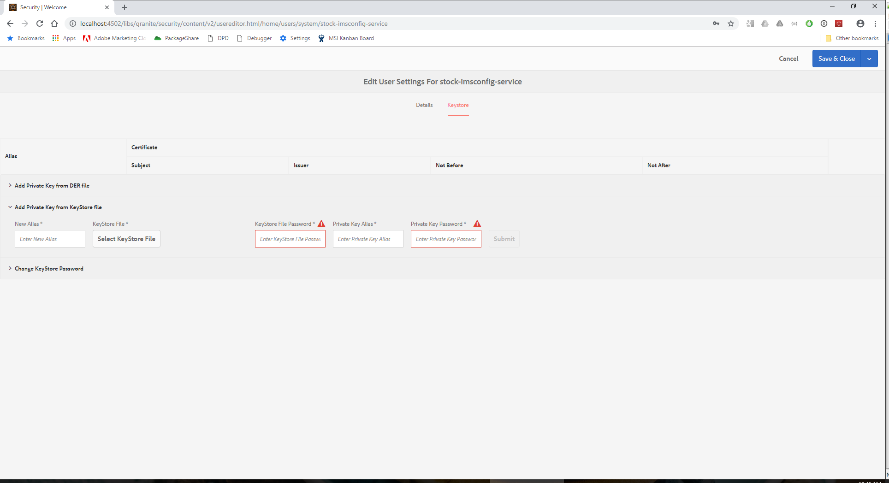
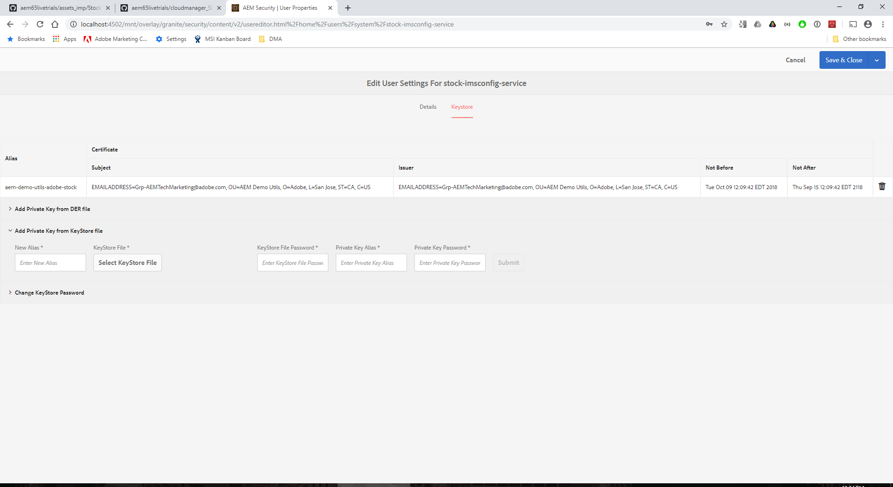
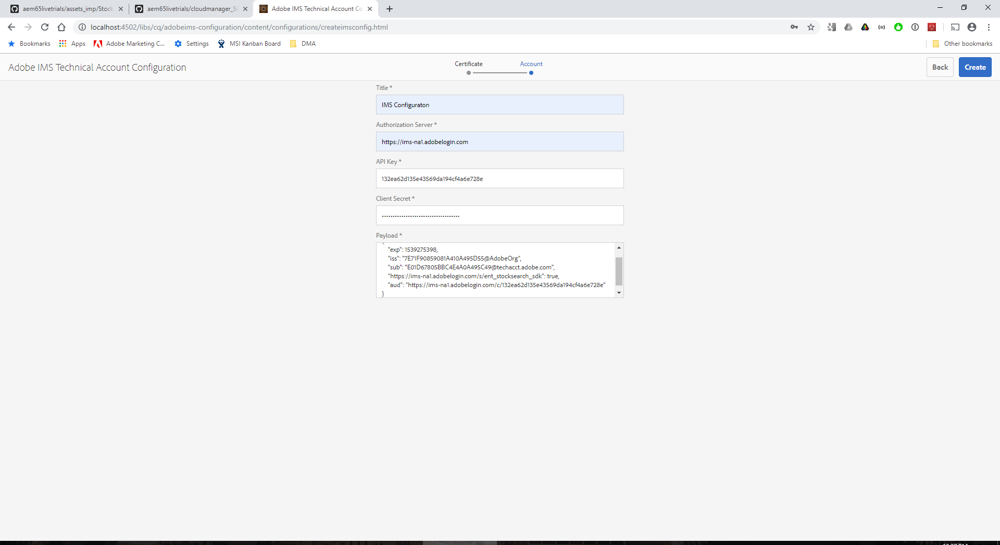
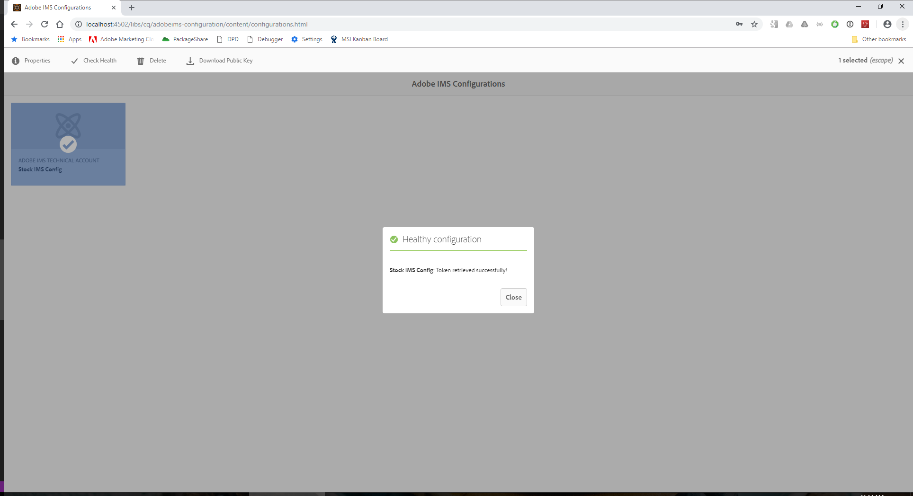
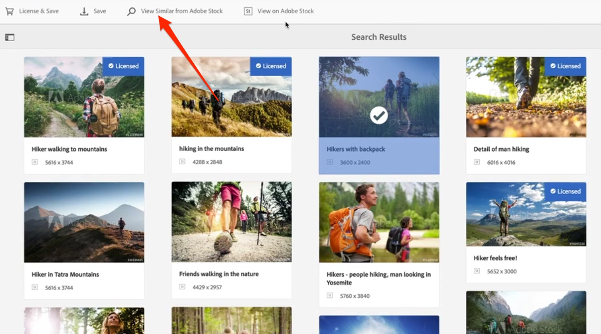
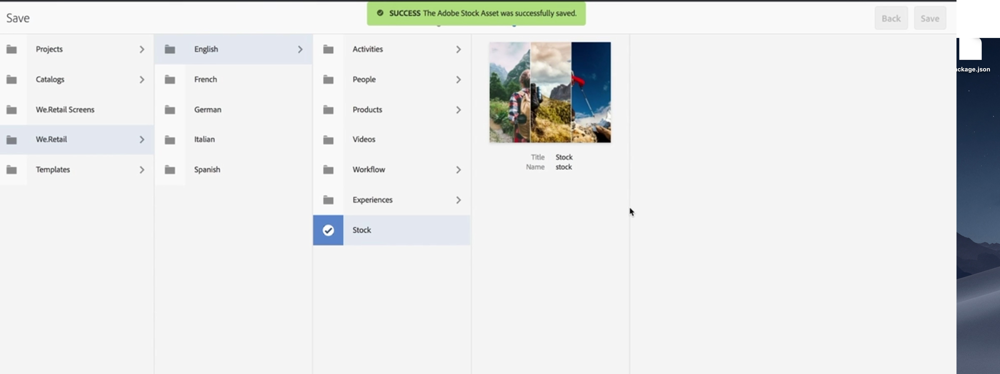

## Integrate AEM Assets with Adobe Stock

### Objective

1. Search and Preview AEM Stock Assets directly from AEM 
2. License and save assets directly to the AEM Digital Assets Manager

### Lesson Context

AEM 6.5 provides users the ability to search, preview, save and license Adobe Stock assets directly from AEM. Organizations can now integrate their Adobe Stock Enterprise plan with AEM Assets to make sure that licensed assets are now broadly available for their creative and marketing projects, with the powerful asset management capabilities of AEM. 

#### Exercise 1.1: Setup Adobe Stock Integration via Adobe I/O
##### Setup Keystore
1. Download keystore-2.p12 file
2. Goto Tools > Security > Users
3. Look for `stock-imsconfig-service` user
4. Select and goto `Keystore` tab
5. Click on `Create KeyStore`
6. Set the new password
7. Click on `Add Private Key from KeyStore file`



8. Specify the following values: <br>
* New Alias: aem-demo-utils-adobe-stock
* KeyStore File: keystore-2.p12
* KeyStore File Password: demo
* Private Key Alias: aem-demo-utils-adobe-stock
* Private Key Password: demo
9. Click on Submit



10. Save and Close

##### Setup Adobe IMS Configuration
1. Goto Tools > Security > Adobe IMS Configuration
2. Click Create
3. Set `Cloud Solutions` to `Adobe Stock`
4. Set `Certificate` to `summit2019`


5. Click Next
6. Spcify the following values:
``` Authorization Server: https://ims-na1.adobelogin.com
API Key: 132ea62d135e43569da194cf4a6e728e
Client Secret: c42f2f31-6bdd-43eb-80eb-c077b311894e
Payload:
{
    "exp": 1539275398,
    "iss": "7E71F90859081A410A495D55@AdobeOrg",
    "sub": "E01D67805BBC4E4A0A495C49@techacct.adobe.com",
    "https://ims-na1.adobelogin.com/s/ent_stocksearch_sdk": true,
    "aud": "https://ims-na1.adobelogin.com/c/132ea62d135e43569da194cf4a6e728e"
}
```
``Hint: Copy the values to a notepad before pasting them to AEM``

 

 7. Click Create
 8. Select the Stock IMS Config
 9. Click on Check Health
 10. You should see ``Stock IMS Config: Token retrieved successfully!``

 

##### Setup Adobe Stock Configuration
1. Goto Tools > Cloud Services > Adobe Stock
2. Click on Create
3. Specify the following values:
```
Title: Adobe Stock Configuration
Associated Adobe IMS Configuration: Stock IMS Config
Locale: English (United States)
```
4. Save and Close

#### Exercise 2: Search Adobe Stock

1. From the main screen of AEM, choose **Assets** and select **Search Adobe Stock**.

2. Search for **hiking** in Adobe Stock and select an unlicensed asset.

3. Examine the options in the toolbar and then select **View Similiar from Adobe Stock**



4. Select an image and choose **View in Adobe Stock**

5. Examine the image and explore the options available in Adobe Stock. 

6. Navigate back to AEM and save the asset by selecting **save** and choose the folder you wish to save it in. 



