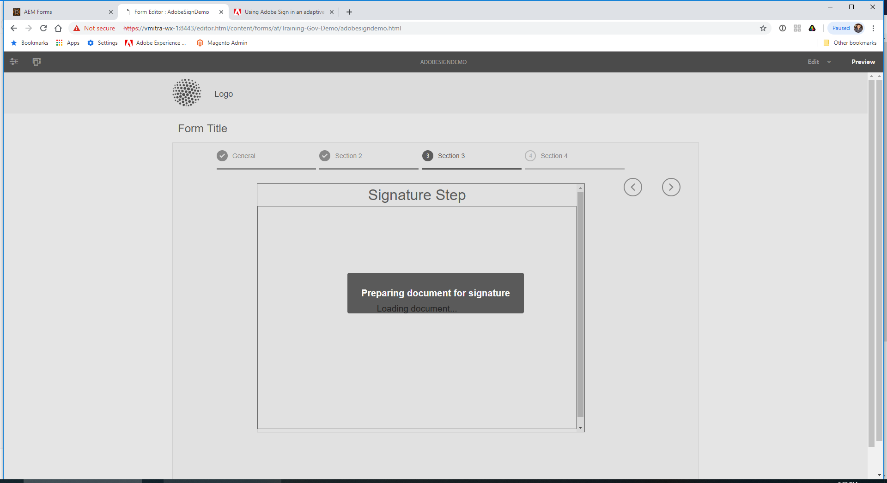
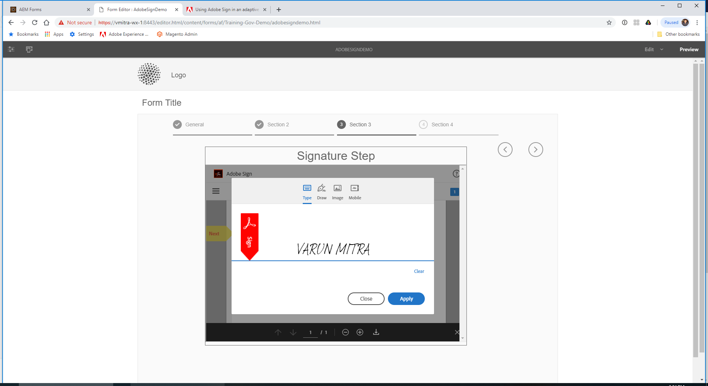

Integrate Adobe Sign with AEM Forms
***

In a typical Adobe Sign and adaptive forms scenario, a user fills an adaptive form to apply for a service. For example, a mortgage and credit-card application requires legal Signatures from all the borrowers and co-applicants. To enable electronic-signature workflows for similar scenarios, you can integrate Adobe Sign with AEM Forms. A few more examples are, you can use Adobe Sign to:

Close deals from any device with fully automated proposal, quote, and contract processes.
Finish Human Resource processes faster and give your employees the digital experiences.
Cut contract cycle times and onboard your vendors faster. 
Create digital workflows that automate common processes.
Adobe Sign integration with AEM Forms supports:

Single and multiple-user signing workflows
Sequential and simultaneous signing workflows  
In-form and out-of-form signing experiences
Signing forms as an anonymous or logged-in user
Dynamic signing processes (integration with AEM Forms workflow)
Authentication through a knowledge base, phone, and social profiles

***

### Prerequisites

You require the following to integrate Adobe Sign with AEM Forms:

* An active [Adobe Sign developer account](https://acrobat.adobe.com/us/en/why-adobe/developer-form.html).
* An [SSL enabled](https://helpx.adobe.com/experience-manager/kt/platform-repository/using/ssl-wizard-technical-video-use.html) AEM Forms server.
* An [Adobe Sign API application](https://www.adobe.io/apis/documentcloud/sign/docs.html#!adobeio/adobeio-documentation/master/sign/gstarted/create_app.md).
* Credentials (Client ID and Client Secret) of Adobe Sign API application.

***

### Configure Adobe Sign with AEM Forms

After prerequisites are in place, perform the following steps to configure Adobe Sign with AEM Forms on the Author instance:

1. On AEM Forms author instance, navigate to Tools  > General > Configuration Browser.

2. On the Configuration Browser page, tap Create.

3. In the Create Configuration dialog, specify a Title for the configuration, enable Cloud Configurations, and tap Create. It creates a configuration container for cloud services.

4. Navigate to Tools  > Cloud Services > Adobe Sign and select the configuration container you created in the above step. <br>
``` Ensure that the URL of the cloud services configuration page starts with HTTPS. If not, enable SSL for AEM Forms server. ```

5. On the configuration page, tap Create to create Adobe Sign configuration in AEM Forms.

6. In the General tab of the Create Adobe Sign Configuration page, specify a Name for the configuration and tap Next. You can optionally specify a title and browse to select a thumbnail for the configuration. <br>
Copy the URL in your current browser window. It is required to configure Adobe Sign application with AEM Forms.

7. Configure OAuth settings for the Adobe Sign application:
    1. Open a browser window and sign in to the Adobe Sign developer account.
    2. Select the application configured for AEM Forms, and tap Configure OAuth for Application.
    3. In the Redirect URL box, add the HTTPS URL copied in the previous step and click Save.
    4. Enable the following OAuth settings for the Adobe Sign application and click Save.
        * aggrement_read
        * aggrement_write   
        * aggrement_send
        * widget_write
        * workflow_read

8. Go back to the Create Adobe Sign Configuration page. In the Settings tab, the OAuth URL field mentions the following default URL: https://secure.na1.echosign.com/public/oauth <br>where: na1 refers to the default database shard. 
You can modify the value for the database shard. Restart the server to be able to use the new value for the database shard.

9. Specify the Client ID (also referred to as Application ID) and Client Secret. Select the Enable Adobe Sign for attachments also option to append files attached to an adaptive form to the corresponding Adobe Sign document sent for signing.

10. Tap Connect to Adobe Sign. When prompted for credentials, provide username and password of the account used while creating Adobe Sign application.

11. Tap Create to create the Adobe Sign configuration.

12. Open AEM Web Console. The URL is http://[server]:[port]/system/console/configMgr

13. Open Forms Common Configuration Service.

14. In the Allow field, select All users - All the users, anonymous or logged in, can preview attachments, verify and sign forms, and click Save. Author instance is configured to use Adobe Sign.

``` 
Now, Adobe Sign is integrated with AEM Forms and ready for use in adaptive forms. To use Adobe Sign service in an adaptive form, specify the configuration container created above in adaptive form properties. 
```
***

### Using Adobe Sign in an adaptive form

#### Create an adaptive form for Adobe Sign

Perform the following steps to create an adaptive form for Adobe Sign:

1. Navigate to Adobe Experience Manager > Forms > Forms & Documents. 

2. Tap Create and select Adaptive Form. A list of templates appear. Select the `Basic with Adobe Sign` template and tap Next.

3. In the Basic tab:

    1. Specify the Name and Title for the adaptive form.
    2. Select the configuration container created while configuring Adobe Sign with AEM Forms.

4. In the Form Model tab, select one of the following options:

    * Select the Associate form template as the Document of Record template option and select a Document of Record template. If you use a form template based adaptive form, then the documents sent for signing display only those fields which are based on the associated form template. It does not display all the fields of the adaptive form.
    * Select the Generate Document of Record option. If you use a Document of Record option enabled adaptive form, then the document sent for signing displays all the fields of the adaptive form.  
5. Tap Create. A sign-enabled adaptive form is created, which can be used to add Adobe Sign fields.


#### Enable Adobe Sign for an adaptive form

Out of the box, Adobe Sign is not enabled for an adaptive form. Perform the following steps to enable it:

1. In the Content browser, tap Form Container, and tap the Configure  icon. It opens properties browser and displays Adaptive Form container properties.

2. In the properties browser, expand the Electronic Signature accordion, and select the Enable Adobe Sign option. It enables Adobe Sign for an adaptive form

3. Select a cloud service from the already configured list of Adobe Sign Cloud Services. 
If the Adobe Sign Cloud Service list is empty, follow the Configure Adobe Sign with AEM Forms artilce to configure the service.  

4. Select the signing order from the Signers can Sign dialog box. 
5. Add  Signers to an adaptive form.
6. Click the Edit  icon to specify the information about the  signer:


7. Tap the Done  icon to save the changes.  


### Verification

1. Goto Preview Mode
2. Switch to Section 3
3. Signature Step will start connecting to Adobe Sign Service


4. Locate the Signature Field and Sign 
