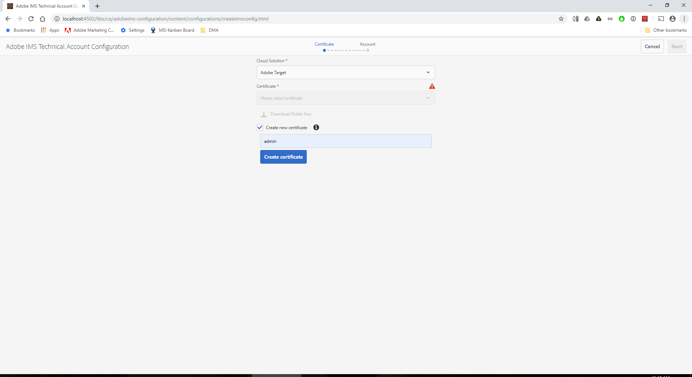
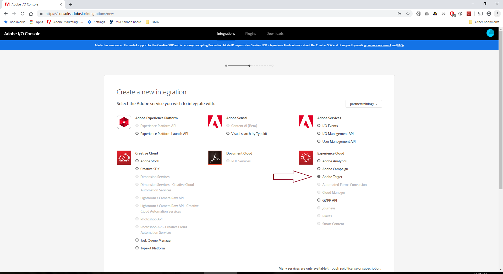
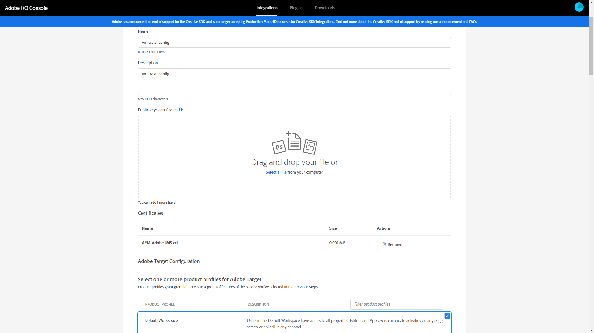
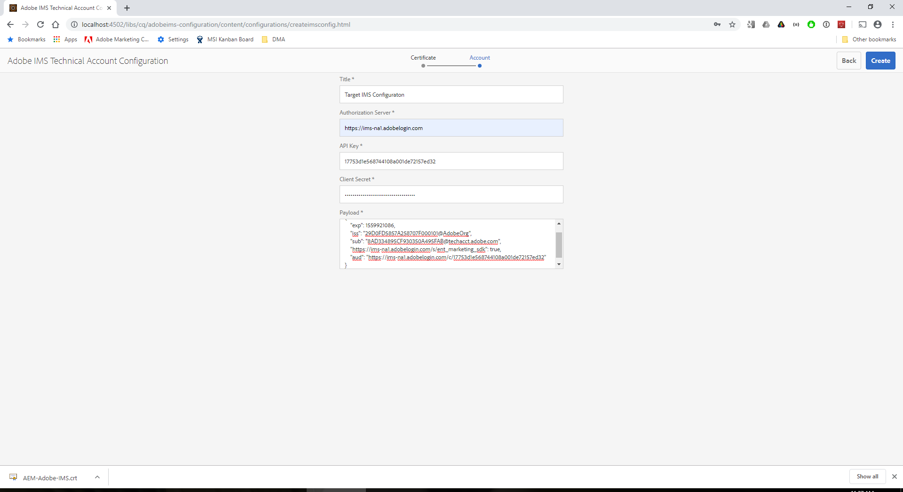
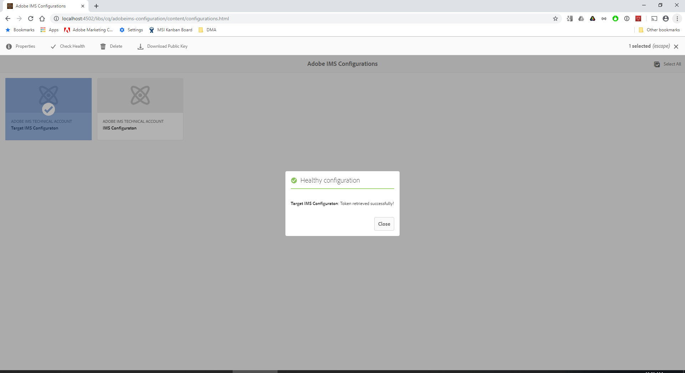
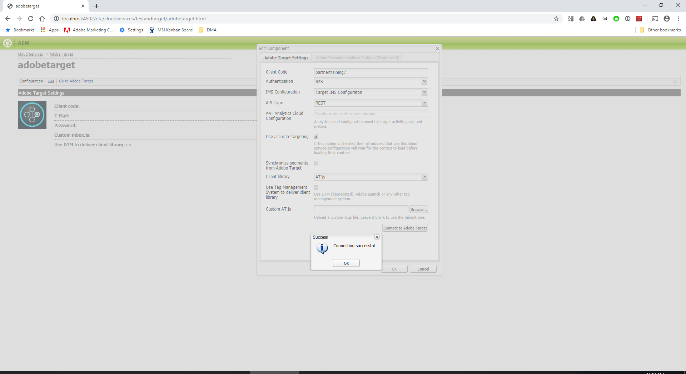
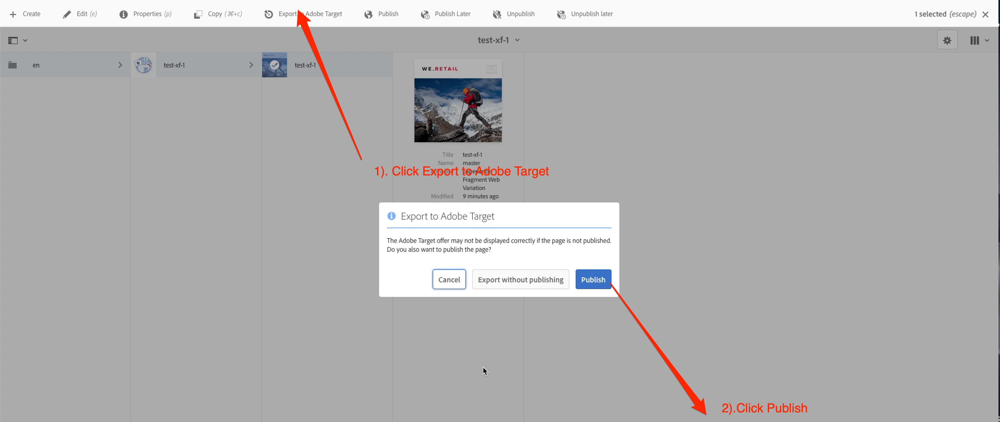
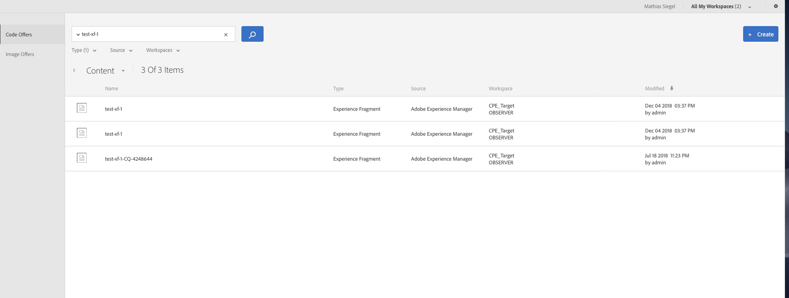
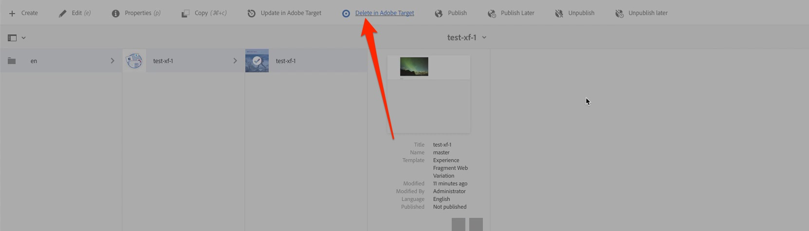

# Experience Fragments

---

### Features

* Experience Fragment to Adobe Target Integration

---

### Set up Ngrok

1. Download ngrok (from [ngork.com](http://ngrok.com)) to your local machine.
2. Open your terminal (cmd window) in the folder that conains the ngrok executable.
3. Run this command: `./ngrok http 4503`
4. Copy the "HTTPS" url.


### Set up AEM Author's Day CQ Link Externalizer

1. Change the third entry to read: `publish https://<your-ngrok-id>.ngrok.io`

### Set up IMS Service Configuration for Adobe Target

1. Navigate to Tools > Security > Adobe IMS Configuration


2. Click `Create`.
3. Specify the following field values:
	* Cloud Solution: `Adobe Target`
	* Create New Certificate: `True`
	* Alias: <specify any alphanumeric value>



4. Click on `Create Certifcate`
5. `Download Public Key`
6. Click `Next` 

``` 
Leave AEM Browser Window Open	
```

7. Navigate to https://console.adobe.io/
8. Login using following credentials:
	* User name: `vmitra+user20@adobetest.com`
	* Password: `Training@1234`

```
You can also use your own Expereince Cloud Organisation
```

9. Click on `View Integrations`
10. Select `ags688` from the dropdown.
11. Click on `New Integration` > `Access an API` > `Continue`
12. Select `Adobe Target`



13. Click `Continue`
14. Provide a `Name` and `Description`
15. Upload the `Public keys certificates` downloaded in step 5.
16. Set the `PRODUCT PROFILE` as `Default Workspace`



17. `Continue to Integration Details`
18. Navigate back to AEM Browser window
19. Copy the values from Adobe I/O Console and paste them in the Adobe IMS Configuration Screen



20. Click on `Create`.
21. Select the IMS Confguration and perform a health check


22. You should see a message like `Target IMS Configuraton: Token retrieved successfully!`



### Set up AEM's Adobe Target Integration

1. Navigate to [Tools > Cloud Services > Legacy Cloud Services > Adobe Searcg & Promote > Adobe Target > Configure Now](http://localhost:4502/libs/cq/core/content/tools/cloudservices.html).
2. Provide the title as `Target` and click `Create`.
3. Confgure the Adobe Target Cloud service as follows:
	* Client Code: `ags688`
	* Authentication: `IMS`
	* IMS Configuration: <IMS Configuration>
	* API Type: `REST` 
	* A4T Analytics Cloud Configuration: `Leave blank`
	* Use accurate targeting: `Yes`
	* Synchronize segments from Adobe Target: `No`
	* Client library: `AT.js`
	* Use DTM to delivery client library: `No`
	* Custom AT.js: `Leave blank`

	

4. Configure cloud configuration on folder. Verify the Export Formats.
  
5. Open the Experience Fragment you created and publish it to Target by clicking **Export to Target** and **Publish**.

  

6. Log in to  Adobe Target at [https://partnertraining7.marketing.adobe.com/target](https://partnertraining7.marketing.adobe.com/target). Enter these credentials:
	* User name: `vmitra+user20@adobetest.com`
	* Password: `Training@1234`

7. Go to Offers and note the HTML and JSON version of the Experience Fragment.

 

7. Return to AEM and use the **Delete from Target Button** to delete the offer from Adobe Target. 

  


---

### Links

* [Using AEM Experience Fragments with Adobe Target](https://helpx.adobe.com/experience-manager/kt/sites/using/experience-fragment-target-feature-video-use.html)


