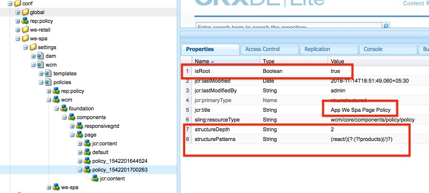

# Set up Page Templates For a Single Page Application (SPA)

### 
* OPTION 1: Install the [CRX package](we-spa%20templates.zip) directly in AEM to create the required templates.
* OPTION 2: Complete the following steps to create your own templates for a SPA Application.

### Create Root Page Template

1. Go to **Tools > Templates > we-spa > Create > Select HTML 5 Page template > Enter Template Title as "root"**.
2. Edit Template > Open **Page Policy > Add Policy  > Provide policy title as "root" **
3. Open **CRXDe > Go to /conf/we-spa/settings/wcm/templates/**.
4. Go to **/policies/wcm/foundation/components/page/policy_XXXX** and add the following properties to policy node for app template : 
    * **isRoot** : Boolean : **true**
    * **structureDepth**:String :**2**
    * **structurePatterns**:String:**(react/)(?:(?!products)(/)?)**
  

5. Screenshot 
6. Go to **/conf/we-spa/settings/wcm/templates/root/initial/jcr:content**.
7. Change **sling:resourceType** property to **we-spa/components/structure/root**.
8. Go to  **/conf/we-spa/settings/wcm/templates/root/jcr:content** and remove **cq:templateType** property from the node.
9. Go to **/conf/we-spa/settings/wcm/templates/root/structure/jcr:content**.
10. Change **sling:resourceType** property to **we-spa/components/structure/root**.

### Create Content Page Template

1. Go to **Tools > Templates > we-spa > Create > Select HTML 5 Page template > Enter Page Name "page"**.
2. Go to page policy, Add new page policy > Policy Title as "page".
3. Add Layout Container to the page > Unlock Layout container > Open Content Policies of Layout Container.
5. Add New Policy "We-spa page components " > Select **we-spa** component group > Save.
6. Open CRXDE > Go to **/conf/we-spa/settings/wcm/templates/page/initial/jcr:content**.
6. Change **sling:resourceType** property to **we-spa/components/structure/page**. 
7. Go to **/conf/we-spa/settings/wcm/templates/page/structure/jcr:content**.
8. Change **sling:resourceType** property to **we-spa/components/structure/page**.
9. Remove **cq:templateType** property from node **/conf/we-spa/settings/wcm/templates/page/jcr:content**.

10. Save All.
11. Enable both **root** and **page** template from the Template Editor Admin Console.
